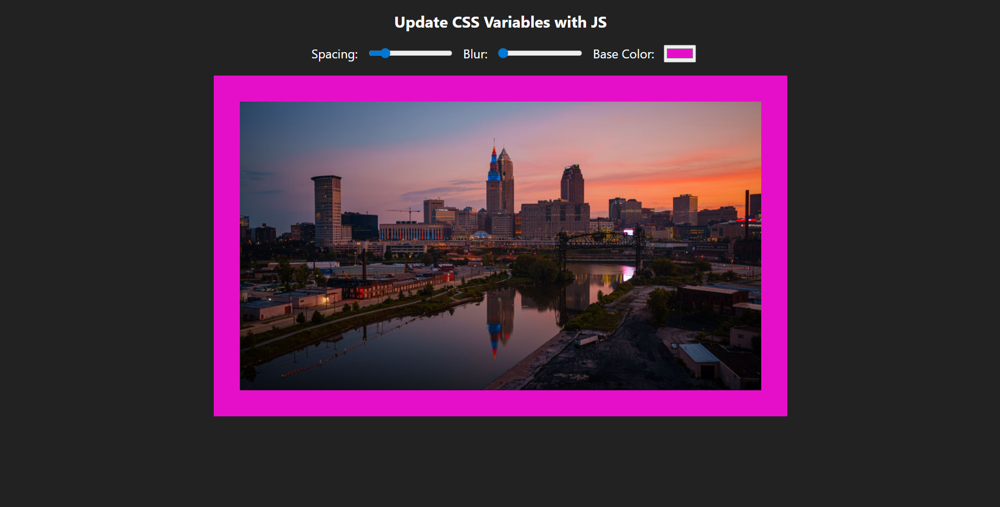

# Image Blur & Color Slider

An interactive image editor that lets users adjust blur, spacing and color settings using sliders.

## About

This is a web-based image adjustment tool built using HTML, CSS, and JavaScript.  
Users can control image blur, spacing and color effects in real time using range sliders, instantly seeing the changes applied to the image.  
I built this project to practice working with input range sliders, CSS filters, and dynamically updating styles with JavaScript.

## Built With

`HTML` `CSS` `JavaScript` `CSS Filters`

## What I Learned

- How to connect range inputs to CSS variables and update image styles in real time using JavaScript.

## Links

- [Live Demo](https://snehashrestha123.github.io/Slider-Blur-Color/)
- [Source Code](https://github.com/Snehashrestha123/Slider-Blur-Color)
